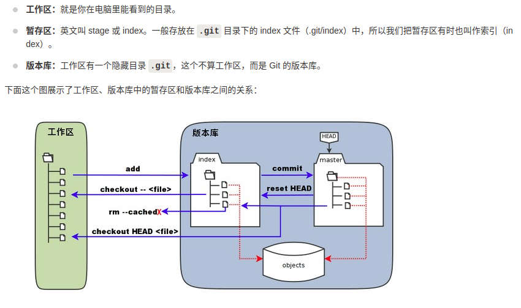
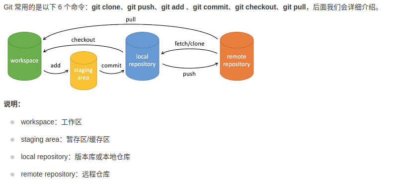

# Tool-Chain
各种工具命令的使用指南

## Git
### Git 原理图


* 安装与用户信息配置
```shell
sudo apt-get install git

git config --global user.name "lizy"
git config --global user.email LizyZZZ@163.com
```
* 常用命令  
```Shell
// (在目录下)创建仓库
git init <dir_name>

// 克隆仓库到指定目录
git clone <repo> <directory>

// 查看当前 git 仓库的状态
git status [-s]

// 显示暂存区和工作区的差异
git diff [file]
// 显示暂存区和上一次提交(commit)的差异
git diff --cached [file]
// 显示

// 添加文件到暂存区
git add <file1> <file2> ...
git add .

// 把暂存区的内容提交到本地仓库
git commit -m "content"
```
